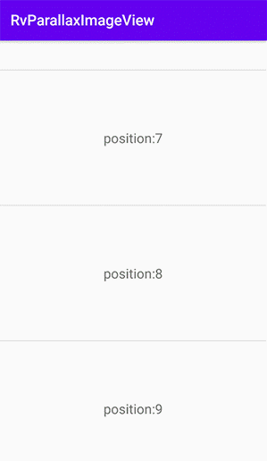
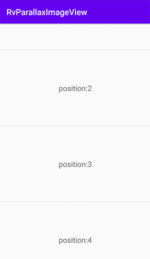

# RvParallaxImageView

[](https://android-arsenal.com/api?level=16) [](https://jitpack.io/#giswangsj/RvParallaxImageView)

An android custom view used on the item of recyclerview to show a full image in the fixed small area. The image view that has parallax performance can be loaded with res drawable/local image/network image. It can be used to show big advertisement image on the item of recyclerview with small area. \

RvParallaxImageView用在recyclerview的item中，它可以随着recyclerview进行视差效果的移动，进而可以在一个小区域的item中展示一个完整的图片。

RvParallaxImageView**没有任何侵入性**，默认提供了加载resource中的drawable、和加载本地磁盘上的图片两种方式。如果你需要使用Glide或Picasso网络加载框架加载网络图片，参看demo：GlideImageController/ PicassoImageController。当然你也可以自定义Controller来使用其他图片加载框架进行加载。

RvParallaxImageView适用于在recyclerview的item中显示大的广告图。

**Preview**



**Load res/local/net image(glide,picasso)**



Implementation
----

Via Gradle:

```groovy
allprojects {
    repositories {
        maven { url 'https://jitpack.io' }
    }
}

dependencies {
	implementation 'com.github.giswangsj:RvParallaxImageView:1.0.1'
}
```


Usage
----

RvParallaxImageView provide two method to load image by default:

- load resource drawable
- load local sdcard image

**first**， add viewholder in you adapter:

```kotlin
class ImageViewViewHolder(view: View) : RecyclerView.ViewHolder(view) {
    val parallaxImageView=view.findViewById<RvParallaxImageView>(R.id.parallaxImageView)
}
```

**second**，bind recyclerView & set image loader controller in onBindViewHolder

```kotlin
override fun onBindViewHolder(holder: RecyclerView.ViewHolder, position: Int) {
    when (position) {
        5 -> {      // 资源图片
            (holder as ImageViewViewHolder).parallaxImageView.apply {
                bindRecyclerView(recyclerView)
                setController(ResImageController(context, R.mipmap.girl))
            }
        }
        10 -> {     // 本地图片
            val imagePath = pathPrefix + "a0.jpg";
            (holder as ImageViewViewHolder).parallaxImageView.apply {
                bindRecyclerView(recyclerView)
                setController(LocalImageController(imagePath))
            }
        }
    }
}
```

## With Glide

you should add GlideImageController

```kotlin
override fun onBindViewHolder(holder: RecyclerView.ViewHolder, position: Int) {
    when (position) {
        15 -> {     // Glide加载
            val imageUrl = "http://gitstar.com.cn:8000/static/img/1.jpg"
            (holder as ImageViewViewHolder).parallaxImageView.apply {
                bindRecyclerView(recyclerView)
                setController(GlideImageController(context, imageUrl))
            }
        }
    }
}
```


## With Picasso

you should add PicassoImageController

```kotlin
override fun onBindViewHolder(holder: RecyclerView.ViewHolder, position: Int) {
    when (position) {
        20 -> {     // picasso加载
            val imageUrl = "http://gitstar.com.cn:8000/static/img/6.jpg"
            (holder as ImageViewViewHolder).parallaxImageView.apply {
                bindRecyclerView(recyclerView)
                setController(PicassoImageController(context, imageUrl))
            }
        }
    }
}
```


Customization
----

If you use other image loading library such as `fresco` and so on, you can refer to `GlideImageController` / `PicassoImageController`

1，new class extends `BaseImageController`

2，add image url param on you constructor

3，override `loadImage()` then get drawable with you image loading library，then call `handleDrawable()`.

for example:

```java
public class GlideImageController extends BaseImageController {

    private Context mContext;

    private String imageUrl;

    public GlideImageController(Context context, String imageUrl) {
        this.mContext = context;
        this.imageUrl = imageUrl;
    }

    @Override
    protected void loadImage(int viewWidth) {
        ...
        // 使用Glide获取drawable
        Glide.with(mContext).load(imageUrl).into(new SimpleTarget<Drawable>() {
            @Override
            public void onResourceReady(Drawable resource, Transition<? super Drawable> transition) {
                // 处理drawable
                handleDrawable(viewWidth, resource);
            }
        });
    }
}
```

or get bitmap with you image loading library，then call `handleBitmap()`.

for example:

```
public class PicassoImageController extends BaseImageController {
    ...
    @Override
    protected void loadImage(int viewWidth) {
        ...
        // 使用Picasso获取bitmap
        Picasso.with(mContext)
                .load(imageUrl)
                .into(new Target() {
                    @Override
                    public void onBitmapLoaded(Bitmap bitmap, Picasso.LoadedFrom from) {
                        // 处理bitmap
                        handleBitmap(viewWidth, bitmap);
                    }
					...
                });
    }
}
```


## License

`RvParallaxImageView` is released under the Apache License version 2.0.